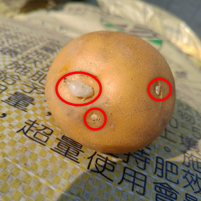
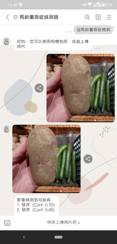
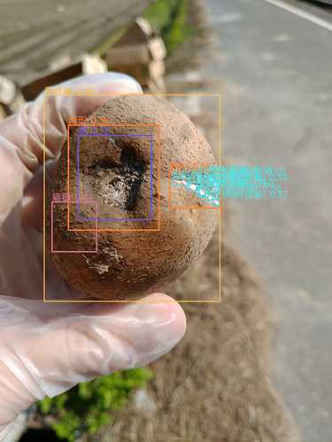
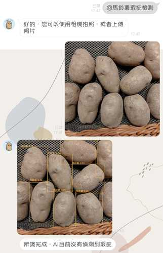

# 馬鈴薯瑕疵檢測－YOLOv7整合LINE Bot應用

更新日期: 2023-03-08

# 目的：

1. 減少食物中毒的機會發生
2. 輕鬆挑選馬鈴薯

# 任務：

- 了解什麼原因造成吃了馬鈴薯後發生食物中毒
    - 哪些瑕疵造成中毒？
    - 有哪些常見瑕疵只是賣相不好？
- 能輕鬆挑選馬鈴薯 → AI要能辨認出瑕疵的狀況
- 需要整合AI偵測模型落地應用的解決方案

# 馬鈴薯常見的瑕疵

## 1. 發芽

發芽的馬鈴薯不能食用

發芽的馬鈴薯有大量的生物鹼（例如龍葵鹼）造成急性中毒

## 2. 發綠

發綠的地方不可食用

馬鈴薯塊莖變綠，因為栽培、貯藏或運送過程中照射到光線造成，發綠的地方生物鹼含量較高

## 3. 瘡痂病

僅在皮層，不耐貯藏，若無其他瑕疵去皮後可食用

馬鈴薯瘡痂病是由多種菌原菌引起的病害，病斑雖然僅限於皮層，但有瘡痂的馬鈴薯不耐貯藏，外觀賣相較差。如果沒有其他瑕疵，多數去皮後是可以食用的。

## 4. 發黑（褐化）

若無其他瑕疵或病害，可食用（仍需謹慎）

在儲藏過程經低溫冷藏，適合馬鈴薯貯存溫度1~3℃為佳，但若低於0°C以下就會凍傷。而凍傷後的馬鈴薯，外皮部分看似透明，內部卻會發黑腐爛。馬鈴薯含有酵素和多酚類基質，而多酚類基質受到酵素作用而氧化後，便會使顏色產生變化。外皮有受損或將馬鈴薯切開、接觸到空氣暴露一段時間後會顏色會變深

## 5. 坑洞

若有腐爛則不可食用

有些洞為蟲蛀，易造成俗稱的爛坑。若外皮呈較透明的黑坑，是因為冷凍所致。

## 6. 畸形（外型不規則）

若無其他瑕疵或病害，可食用

因高溫乾旱等不良條件，使正在膨大的塊莖停止生長，表皮木栓化。此時如再遇雨或灌溉，給予了適宜的生長條件，但由於塊莖表皮已經木栓化，不能繼續生長，只能從生理活性強的芽眼處二次生長，而形成了各種形狀不規則的馬鈴薯。

## 7. 白絹病（或發霉）

不可食用

在生長過程中感染了植物病原真菌，造成馬鈴薯白絹病，上面的白毛，是發病嚴重時期的病原菌的菌絲

# 設定辨識型態

- 只限定馬鈴薯
- 完整未切過
- 單顆、多顆均可
- 有無簡易清潔過均可

# 以YOLOv7訓練瑕疵辨識的物件偵測模型

不採用影像分類，因無法解決多瑕疵物件、多顆馬鈴薯的問題，而採YOLOv7 物件偵測模型，亦可直接呈現瑕疵位置。

## 訓練資料

蒐集時間自2022年12月至2023年2月，於雲林的有機農場、雙北各大超市及大賣場、農產銷售中心等。多以台灣「台農1號」黃金馬鈴薯、美國進口馬鈴薯為瑕疵資料來源。

資料2,389張照片，21,656筆標註資訊，以 YOLOv7 模型為基礎，分別將 v7、v7-tiny、v7-W6、v7-X、v7-E6、v7-D6、v7-E6E等基礎模型進行遷移學習(transfer learning)比較。

# 整合YOLOv7模型及行動化應用

# LINE Bot功能

# 結果呈現

**A. 有偵測到瑕疵，回傳瑕疵標示照片及文字**

**B. 沒有偵測到瑕疵**

**C. 上傳的照片沒有馬鈴薯**

回覆請重新上傳

# 後記

從拍攝照片、前處理、到產出模型並整合模型以及LINE Bot 的應用，歷經大約兩個月的時間，看到呈現結果還不錯，且在賣場中實際協助到辨識的功能，至少有達成預設協助辨識的目標。未來時間允許下或許可以再嘗試整合及時辨識的手機APP邊緣運算開發，擴展及時辨識的應用。

---
YOLOv7 原始程式

YOLOv7 Fork repo 來源: [pHidayatullah/yolov7](https://github.com/pHidayatullah/yolov7) 

原始 YOLOv7 程式碼 forked from [WongKinYiu/yolov7](https://github.com/WongKinYiu/yolov7)

---
(其他沒有寫在程式中的)  
致謝

- Ting-Chen Lee: 照片標註方法、YOLO模型訓練數據實驗、程式端Potato 偵測閾值的設定及建議
- Yu-Lin-Tseng: 資料庫架設
- TL Lee: 各項LINE Bot 行為分析
- CHIEN-YU HWANG: GCP部署